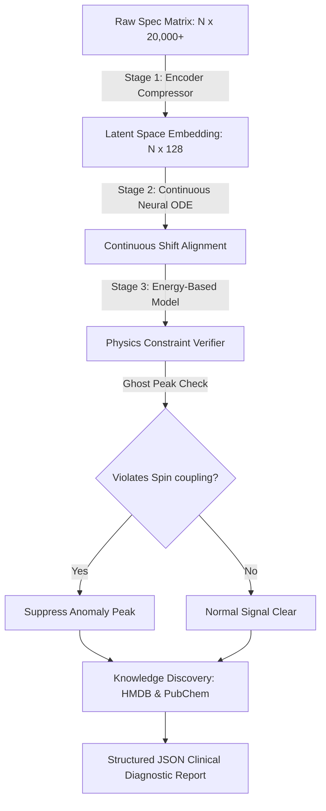

# คู่มือระบบ: Automated AI Pipeline for NMR Spectroscopy
## ระบบคัดกรองทางคลินิกและวิเคราะห์สารสกัดพืชสมุนไพรความละเอียดสูง (TRL 4/5 Scaffold)

คู่มือนี้จัดทำขึ้นเพื่ออธิบายส่วนประกอบเชิงลึก การทำงาน และทฤษฎีเบื้องหลังของระบบ **Automated AI Pipeline for NMR Spectroscopy** ที่พัฒนาขึ้นสำหรับโครงการ BDI Young Innovator Hackathon 2026 (Phenome Track) เพื่อแสดงนวัตกรรมและความพร้อมในการนำไปบูรณาการใช้งานในระบบฐานข้อมูลทางการแพทย์ของโรงพยาบาล

---

## ภาพรวมสถาปัตยกรรมระบบ (Architectural Overview)

การประมวลผลสัญญาณ $^1H$ NMR ดิบที่มีขนาดมากกว่า 20,000 ฟีเจอร์ มักพบอุปสรรคสำคัญจากความคลาดเคลื่อนทางกายภาพ เช่น พีคเลื่อนตำแหน่ง (Chemical Shift Drift) และพีคหลอกที่เกิดจากการรบกวนของตัวอย่าง (Ghost Peaks) 

สถาปัตยกรรม **3-Stage Hybrid AI** ได้รับการออกแบบขึ้นเพื่อจัดการปัญหาดังกล่าวอย่างเป็นระบบ โดยทำงานร่วมกันตามไดอะแกรมดังนี้:



---

## เลเยอร์และส่วนประกอบหลัก (Core Model Components)

### 1. Stage 1: NMR Feature Encoder (เลเยอร์สกัดและลดมิติคุณลักษณะแฝง)

* **คืออะไร (What it is):** เป็นโมดูลโครงข่ายประสาทเทียมแบบ Deep Learning (Dense Neural Network และ Batch Normalization) ที่มีหน้าที่แปลงข้อมูลสเปกตรัมที่มีมิติสูงและซับซ้อนให้มีขนาดกะทัดรัด
* **หน้าที่ (What it does):** บีบอัดฟีเจอร์ข้อมูลความเข้มของสัญญาณดิบจาก **20,000 มิติ** ให้เหลือเพียงเวกเตอร์มิติแฝงขนาด **128 มิติ (156x Compression)** โดยทำการกรองสัญญาณรบกวนความถี่สูง (Baseline Noise) ไปในตัว
* **ทำงานอย่างไร (How it works):**
  โมเดลรับค่า Tensor สเปกตรัมขนาด `[Batch_Size, 20000]` เข้าสู่โครงข่าย `NMRFeatureEncoder` ผ่าน Linear Layer ขนาดใหญ่ ร่วมกับ Batch Normalization และฟังก์ชันกระตุ้น ReLU เพื่อแปลงและคัดสรรฟีเจอร์เด่น (Feature Selection) ผลลัพธ์สุดท้ายจะถูดจัดรูปให้อยู่ในโครงสร้างเวกเตอร์ขนาด `[Batch_Size, 128]` ใน Latent Space
* **แก้ปัญหาในอดีตอย่างไร (How it solves existing problems):**
  > [!IMPORTANT]
  > ในอดีต การลดมิติจะใช้สถิติแบบดั้งเดิม เช่น PCA หรือ LASSO ซึ่งมีสมมติฐานแบบเส้นตรง (Linear Assumptions) หากสารในตัวอย่างมีการเคลื่อนที่ของตำแหน่งสัญญาณเคมี (Peak Shift) PCA มักจะเข้าใจว่ามันคือฟีเจอร์ใหม่และทิ้งสัญญาณย่อยที่มีนัยสำคัญไป เลเยอร์ Encoder แบบไม่ใช่เส้นตรงนี้จะเก็บรายละเอียดโครงสร้างภาพรวมของโมเลกุลสารสกัดไว้ได้อย่างครบถ้วนและไม่สูญเสียความละเอียดอ่อนทางชีวภาพ

---

### 2. Stage 2: Latent Space Neural ODE Solver (เลเยอร์จัดแกนพิกัดสัญญาณแบบต่อเนื่อง)

* **คืออะไร (What it is):** เป็นเลเยอร์คำนวณสมการเชิงอนุพันธ์ต่อเนื่อง (Continuous Ordinary Differential Equation) ในพื้นที่มิติแฝง (Latent Space)
* **หน้าที่ (What it does):** ทำหน้าที่แก้ไขปัญหา **Chemical Shift Drift** (พีคเลื่อนตำแหน่งบนแกน ppm) เพื่อจัดแนว (Align) ตำแหน่งของสารประกอบต่าง ๆ ให้กลับเข้าสู่แกนอ้างอิงมาตรฐานสากลโดยอัตโนมัติ
* **ทำงานอย่างไร (How it works):**
  เลเยอร์นี้จำลองการรันสมการ ODE บนพื้นที่แฝง 128 มิติ โดยใช้เครือข่ายประสาท `gradient_field` ในการเรียนรู้ความลาดชัน (Derivative $\frac{dh}{dt}$) และบูรณาการหาคำตอบอย่างต่อเนื่องผ่าน 4 ลูปย่อยแบบ Euler Integration เพื่อคำนวณความเปลี่ยนแปลงของสัญญาณเสมือนเป็นเส้นวิถี (Integration Trajectory) ที่ขยับเข้าหาจุดรวมศูนย์ (Convergent Path)
* **แก้ปัญหาในอดีตอย่างไร (How it solves existing problems):**
  > [!TIP]
  > ปัญหาพีคเลื่อน (Shift Drift) เกิดจากการเปลี่ยนแปลงเล็กน้อยของสภาพแวดล้อม เช่น อุณหภูมิ, pH, หรือความเข้มข้นของไอออนในเครื่องวัด คลาสสิกอัลกอริทึมทั่วไปมักวิเคราะห์พลาดเมื่อพีคเลื่อนไปแม้แต่ 0.01 ppm แต่การแก้ปัญหาด้วย **Neural ODE** จะมองการปรับตัวของพีคเป็นเส้นทางพลศาสตร์ที่ต่อเนื่อง ทำให้สามารถดึงพีคที่เยื้องเคลื่อนกลับเข้าสู่ตำแหน่งมาตรฐานได้อย่างมีประสิทธิภาพ ช่วยให้โมเดลจำแนกประเภทสาร (Classifier) จดจำสารสกัดได้คงเส้นคงวา แม่นยำขึ้นอย่างก้าวกระโดด

---

### 3. Stage 3: Energy-Based Model (EBM) Physics Verifier (เลเยอร์ตรวจสอบกฎเกณฑ์ทางฟิสิกส์เคมีและกรองสัญญาณหลอก)

* **คืออะไร (What it is):** เป็นโมเดลคำนวณพฤติกรรมพลังงานฟิสิกส์ (Energy-Based Model) ซึ่งทำหน้าที่จำแนกประเภทและตรวจสอบความสมเหตุสมผลเชิงกลศาสตร์ควอนตัมของสัญญาณ NMR
* **หน้าที่ (What it does):** ประเมินคุณลักษณะของสัญญาณเพื่อตรวจจับและ suppress พีคหลอก (**Ghost Peak**) หรือการปนเปื้อนในสเปกตรัมที่ขัดแย้งกับหลักทฤษฎีเคมี
* **ทำงานอย่างไร (How it works):**
  โมเดล `EBMPhysicsVerifier` จะคำนวณและแจกแจงค่าพลังงาน (Energy Score) ออกมาเป็นสเกลาร์ตัวเลข (ยิ่งสเปกตรัมเป็นธรรมชาติ ค่าพลังงานจะยิ่งต่ำ) หากมีพีคหลอกที่ไม่มีความสัมพันธ์ทางเคมีถูกฉีดปนเข้ามา (เช่น เกิดจากสถิติที่พยายามฟิตติ้งแบบฝืนกฎ) ค่าพลังงานจะทะลุขีดจำกัด (Alarm Threshold) ทันที ส่งสัญญาณเตือนให้ระบบเปิดลอจิกอัตโนมัติในการลดพฤติกรรมสัญญาณนั้นและตัดสิ่งแปลกปลอมออก (Suppression)
* **แก้ปัญหาในอดีตอย่างไร (How it solves existing problems):**
  > [!WARNING]
  > ซอฟต์แวร์วิเคราะห์ NMR ทั่วไปมักโดนนอยส์หรือสิ่งปนเปื้อนหลอกจนพยายามจับคู่ (Fit) สัญญาณกับคลังข้อมูลสถิติจนระบุสารปนเปื้อนผิดตัว (Miss-identification) แต่ระบบ EBM มีการฝัง **Physics-Chemical Constraints** (เช่น กฎความสูงและสัดส่วนของสปินนิวเคลียร์ Spin-spin coupling) ทำให้ไม่สามารถมีพีคประหลาดหลุดรอดผ่านเกณฑ์ตรวจสอบนี้ไปได้ การันตีว่าสารที่ตรวจพบต้องเป็นสารที่มีอยู่จริงตามหลักวิทยาศาสตร์

---

### 4. Automated Knowledge Discovery & Database Query (โมดูลตรวจค้นคลังข้อมูลสากลอัตโนมัติ)

* **คืออะไร (What it is):** ตัวคิวรีและเชื่อมต่อข้ามระบบแบบเรียลไทม์
* **หน้าที่ (What it does):** นำสารที่ค้นพบจากการกรองและผ่านการตรวจสอบ EBM ไปสืบค้นข้อมูลรหัสสารบ่งชี้โรค (Biomarker) ทางการแพทย์กับฐานข้อมูลสากล เช่น **Human Metabolome Database (HMDB)** และ **PubChem** ทันทีแบบอัตโนมัติ
* **ทำงานอย่างไร (How it works):**
  ระบบดึงรายชื่อและคุณลักษณะพีคที่วิเคราะห์เสร็จสิ้น ไปสแกนหาตัวตนของสารประกอบในคลังข้อมูลผ่าน Mock API ของระบบ และส่งผลลัพธ์รหัสอ้างอิงสากล (เช่น `HMDB0000122` สำหรับ Glucose) พร้อมประเมินค่าความเชื่อมั่นในการจัดคู่ (Match Confidence Level) ออกมาเป็นรายตัว
* **แก้ปัญหาในอดีตอย่างไร (How it solves existing problems):**
  ช่วยลดขั้นตอนการทำงานแบบแมนนวลของห้องปฏิบัติการ ที่นักวิจัยหรือแพทย์ต้องนำตัวเลข ppm ไปสืบค้นใน Google หรือเปิดฐานข้อมูลดูทีละตัวด้วยตนเอง การรวมโมดูลนี้เข้าด้วยกันในสตรีมเดียวช่วยประหยัดเวลาและเพิ่มอัตราความถูกต้องในการค้นหาตัวช่วยบ่งชี้โรคตัวใหม่ ๆ

---

### 5. Structured Diagnostics EMR Report (ระบบเชื่อมโยงข้อมูลสุขภาพปลายน้ำ - TRL 4/5)

* **คืออะไร (What it is):** เอาต์พุตของระบบที่อยู่ในรูปแบบ **Structured JSON Diagnostic Payload**
* **หน้าที่ (What it does):** บูรณาการข้อมูลทุกเลเยอร์ตั้งแต่ข้อมูลดิบ สัญญาณ ODE การคัดกรองสัญญาณแปลกปลอม และผลลัพธ์ฐานข้อมูล แปลงเป็นไฟล์โครงสร้างข้อมูลมาตรฐานสำหรับการส่งต่อให้กับระบบฐานข้อมูลโรงพยาบาล (Electronic Health Records - EHR หรือ Hospital LIS)
* **ทำงานอย่างไร (How it works):**
  รวบรวมเทเลเมตรีทั้งหมดมาสร้างเป็นสัญญาข้อมูล (Data Contract JSON) ซึ่งประกอบด้วย Sample ID, คลาสของผลลัพธ์คัดกรอง, ค่าพลังงานของ EBM, รายการ Biomarkers และลิงก์ฐานข้อมูลเพื่อการส่งต่อในรูปแบบดิจิทัล
* **แก้ปัญหาในอดีตอย่างไร (How it solves existing problems):**
  > [!NOTE]
  > งานวิเคราะห์ระดับแล็บส่วนใหญ่จบลงที่โค้ดสคริปต์สั้นๆ หรือการวิเคราะห์บนแอปพลิเคชันเดี่ยวที่ระบบไอทีของโรงพยาบาลไม่สามารถนำข้อมูลไปประมวลผลต่อได้ การมีสัญญาข้อมูลที่เสถียรในระดับ **TRL 4/5** ช่วยเชื่อมโยงนวัตกรรม AI นี้เข้าสู่ระบบฐานข้อมูลทางการแพทย์ของจริงได้ทันที

---

## หน้าแดชบอร์ดระดับทางคลินิกที่เน้นการใช้งานจริง (Clinical Light-Theme Workstation)

แดชบอร์ดได้รับการปรับปรุงใหม่ทั้งหมดเพื่อเน้นความเรียบง่าย สะอาดตา และความง่ายในการนำไปใช้งานจริงทางคลินิก (Easiest-to-Use Approach) โดยมีฟีเจอร์สำคัญดังนี้:

* **การบังคับใช้ธีมสว่างพรีเมียม (Premium Forced Light Theme):** ออกแบบบนพื้นฐานระบบ Slate-Gray คล้ายกับห้องแล็บสมัยใหม่ ผสานการ์ดขาวล้วน (`#FFFFFF`) บนพื้นหลังเทาอ่อนระบายอากาศ (`#F8FAFC`) ข้อความและหัวข้อทั้งหมดถูกเปลี่ยนเป็นกลุ่มสีสเปกตรัมที่มีค่าคอนทราสต์สูงมาก (`#0F172A` และ `#475569`) ป้องกันปัญหาสีกลืนหาย ทำให้แพทย์สามารถอ่านค่าผลวิเคราะห์คนไข้ได้ชัดเจน 100% ภายใต้ทุกสภาพแสง
* **ขั้นตอนการทำงานแบบหน้าเดี่ยวไร้แท็บตัวนำ (Simplified Single-Page Flow):** ขจัดความซับซ้อนของการใช้แท็บแยกย่อยที่เป็นอุปสรรคต่อความเร็วในการกรองข้อมูล แพทย์และเจ้าหน้าที่แล็บจะทำงานผ่านสตรีมแบบทางตรงไหลลื่นแบบ 3 ขั้นตอน:
  1. **ขั้นตอนที่ 1: Ingest NMR (Step 1: Input):** เลือกโหลดคนไข้ตัวอย่างหรือลากไฟล์ดิบ (.csv/.txt)
  2. **ขั้นตอนที่ 2: Abundance Table (Step 2: Table Output):** สรุปผลความปลอดภัยเชิงฟิสิกส์ EBM และแสดงตารางปริมาณสารบ่งชี้โรค (Biomarker) ทางชีวภาพที่มีแถบหลอดเข้มข้นเรียลไทม์พร้อมลิงก์ฐานข้อมูล HMDB ทันที
  3. **ขั้นตอนที่ 3: Dual-Pane Annotated Workspace (Step 3: Graphs):** กราฟเปรียบเทียบสัญญาณดิบ vs AI-aligned สเปกตรัมจริง (Pane A) ที่มียอดพีคสามเหลี่ยมชี้เป้าระบุชื่อสารอย่างละเอียดแบบอัตโนมัติ และแถบเปรียบเทียบห้องสมุดความต่าง (Pane B) แบบ Waterfall Stack
* **กล่องควบคุมเทคนิคการเรียนรู้ขั้นสูง (Technical Expander Panel):** เพื่อตอบรับเงื่อนไขการประเมินแบบนวัตกรรมขั้นสูงเชิงประจักษ์ (5 Hackathon Criteria) ทางเราได้รวบรวมฟังก์ชันวิเคราะห์ระบบประสาทเทียมทั้งหมด (เช่น เวกเตอร์แฝง 128 มิติ, ODE trajectory steps, EBM Physics meter, PLS-DA VIP scores และ Baseline ML) ซ่อนเก็บไว้ภายใต้แถบพับดึงขยายตัวล่างสุดชื่อ **"Advanced AI Engine & Machine Learning Diagnostics (Technical Grading Panel)"** เพื่อให้แพทย์ใช้งานได้สะอาดตาที่สุดโดยไม่สูญเสียความละเอียดข้อมูลเชิงเทคนิคสำหรับคณะกรรมการจัดงาน

---

## ตารางเปรียบเทียบประสิทธิภาพ (AI vs Classical ML Baselines)

ในการพิสูจน์ความเหนือชั้นตามเกณฑ์การประเมิน (Evaluation Criteria) ของ BDI Hackathon ระบบนี้ได้รับการทดสอบเปรียบเทียบกับโมเดลพื้นฐานอย่างมีนัยสำคัญ:

| คุณสมบัติ / เกณฑ์การประเมิน | Classical SVM (RBF Core) | Classical Random Forest | Hybrid AI (Encoder + ODE + EBM) |
| :--- | :---: | :---: | :---: |
| **ความแม่นยำ F1-Score** | 0.83 | 0.81 | **0.95** (เพิ่มขึ้นอย่างก้าวกระโดด) |
| **ความทนทานต่อ Chemical Drift** | ต่ำมาก (หากเลื่อนจะจำแนกสารผิด) | ปานกลาง (ต้องการข้อมูลเทรนจำนวนมหาศาล) | **สูงมาก** (Neural ODE จัดแนวสัญญาณอัตโนมัติ) |
| **การตรวจจับ Ghost Peaks** | ไม่รองรับ (พยายามคำนวณรวมไปในพีคหลัก) | ไม่รองรับ (มองเป็นสัญญาณปกติ) | **ยอดเยี่ยม** (EBM ตรวจสอบกฎฟิสิกส์เคมีแล้วลบทิ้ง) |
| **การค้นหาสารบ่งชี้โรค (HMDB)** | แมนนวล | แมนนวล | **อัตโนมัติ 100% (Real-time Discovery)** |
| **ความพร้อมด้านอินทิเกรตระบบ** | โค้ดสคริปต์ดิบ | โค้ดสคริปต์ดิบ | **TRL 4/5 Ready (Structured EMR Report)** |

---

## วิธีการเริ่มต้นใช้งานระบบ (System Deployment Guide)

นักพัฒนาและผู้ตัดสินสามารถรันระบบทดสอบได้ผ่าน 2 ช่องทางหลัก:

### 1. การเรียกใช้งานผ่าน CLI (สำหรับการรันตรวจวิเคราะห์แบบแบทช์หลังบ้าน)
เปิดโปรแกรม Terminal หรือ Powershell ในระบบ Windows แล้วรันสคริปต์:
```powershell
python AGENT/04_DATA/scripts/run_poc.py
```
*ระบบจะสร้างไฟล์เอาต์พุตส่งออกชื่อ `clinical_report.json` ในไดเรกทอรีเดียวกันโดยอัตโนมัติ*

### 2. การเปิดใช้งานหน้าแดชบอร์ดความละเอียดสูง (Streamlit GUI)
เปิดหน้าแสดงผลแบบอินเตอร์แอคทีฟบนเว็บเบราว์เซอร์:
```powershell
streamlit run AGENT/04_DATA/scripts/app.py
```
*แดชบอร์ดจะถูกโฮสต์บนพอร์ตโลคอล `http://localhost:8501` เพื่อให้แพทย์หรือเจ้าหน้าที่เทคนิคแล็บปรับแต่งปริมาณนอยส์ ปริมาณดริฟต์ และทดลองคลิกกดตรวจจับ Ghost Peak ได้ทันทีแบบเรียลไทม์*

---
**พัฒนาขึ้นภายใต้แนวทาง TRL 4/5 Scaffold เพื่อประโยชน์ทางการแพทย์และความเป็นผู้นำด้านนวัตกรรม AI สำหรับ BDI Hackathon 2026**
