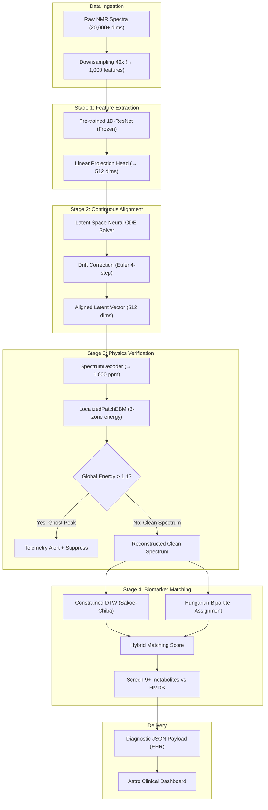

# 📊 ข้อมูลรวมสำหรับสไลด์พรีเซนเทชัน — BDI Young Innovator Hackathon 2026

> **วันนำเสนอ: 2 กรกฎาคม 2569**
> เอกสารนี้รวบรวมข้อมูลจากทุกไฟล์ในโปรเจกต์ จัดเรียงตามลำดับสไลด์ พร้อมระบุส่วนที่ต้องเพิ่มเติม

---

## สไลด์ 1: Cover

### ข้อมูลที่มี ✅
| รายการ | รายละเอียด |
|:---|:---|
| **ชื่อโปรเจกต์ (TH)** | NMR-Deep: แพลตฟอร์มปัญญาประดิษฐ์ไฮบริดร่วมกับฟิสิกส์เคมีสำหรับการตรวจคัดกรองและจับคู่สารบ่งชี้ชีวภาพความละเอียดสูงบนข้อมูลฟีโนม |
| **ชื่อโปรเจกต์ (EN)** | NMR-Deep: Hybrid Physics-Aware AI Platform for High-Resolution Phenome Biomarker Profiling |
| **Track** | Track 1: Phenome |
| **แนวคิดหลัก (Tagline)** | ผสานสมการฟิสิกส์เคมีเข้าสู่โครงข่ายประสาทเทียม เพื่อลบล้างสัญญาณคลาดเคลื่อนและตรวจหาพีคสิ่งปนเปื้อนในสเปกตรัม NMR ระดับคลินิก |
| **งาน** | BDI Young Innovator Hackathon 2026 |
| **หัวหน้าทีม** | นางสาวภารดี พิมเลขาภรณ์ |
| **ขนาดทีม** | 2 คน |

### ⚠️ ข้อมูลที่ต้องเพิ่ม
- [ ] **ชื่อทีม** — ยังไม่ปรากฏในเอกสาร
- [ ] **ชื่อสมาชิกทีมคนที่ 2** และตำแหน่ง/บทบาท
- [ ] **โลโก้ทีม** (ถ้ามี)
- [ ] **โลโก้ BDI / ผู้สนับสนุน** (ถ้ามี)
- [ ] **มหาวิทยาลัย/สถาบัน** ของทีม (น่าจะเป็น KKU จากชื่อโปรเจกต์ต้นแบบ)

---

## สไลด์ 2: The Problem (Pain Points)

### ข้อมูลที่มี ✅

#### ปัญหาหลัก 4 ประการ
1. **Chemical Shift Drift (พีคเลื่อนตำแหน่ง)**
   - pH ของปัสสาวะมนุษย์ผันแปร **4.5 ถึง 8.0**
   - สาร Citrate (2.50–2.75 ppm) และ Creatinine (3.07 ppm) มีการเลื่อน **0.01–0.05 ppm**
   - บนแกนสัญญาณ **20,000–40,000+ มิติ** ทำให้ ML แบบเดิมเปรียบเทียบผิด

2. **คำสาปแห่งมิติ (Curse of Dimensionality / N ≪ P)**
   - ตัวอย่างทางคลินิก N ≈ 50–500 ตัวอย่าง
   - มิติสัญญาณ P ≥ 20,000 คุณลักษณะ
   - Neural Network ทั่วไปจึง Overfitting → ล้มเหลวเมื่อใช้กับแล็บอื่น

3. **Ghost Peaks (พีคปลอมจากสิ่งปนเปื้อน)**
   - สารปนเปื้อนจากสารทำความสะอาด, ตัวทำละลาย, ข้อผิดพลาดเครื่องมือ
   - เครื่องมือดั้งเดิมแยกไม่ได้ → False Positive Biomarker Discovery → เสี่ยงต่อการวินิจฉัย

4. **Signal Overlapping (พีคทับซ้อน)**
   - สารกลุ่มคาร์โบไฮเดรตและไขมัน (1.0–4.5 ppm) ทับกันหนาแน่น
   - สารที่มีความเข้มข้นต่ำ (Low-abundance biomarkers) ถูกบดบังหมด

#### ปัญหาเชิง Workflow
- **Extreme Overlapping:** พีคซ้อนทับหนาแน่น → ยากต่อการแยกแยะด้วยตาเปล่า/Rule-based
- **Time-Consuming:** ผู้เชี่ยวชาญต้องนั่งวิเคราะห์ Manual (Peak Picking) → คอขวดในโรงพยาบาลและห้องแล็บ
- **Subjectivity & Human Error:** ผลลัพธ์ขาดความสม่ำเสมอ
- **Clinical Scalability:** ต้นทุนสูง + ช้า → ยากที่จะ Screen ระดับประชากร

### ⚠️ ข้อมูลที่ต้องเพิ่ม
- [ ] **ภาพ/กราฟิกประกอบ** แสดง NMR spectrum ที่มีปัญหาพีคเลื่อน/ซ้อนทับ (สามารถใช้ภาพจาก `Domain_1_processed_NMR_spectrum.pdf` ได้)
- [ ] **Quote หรือคำพูดจากผู้เชี่ยวชาญ/นักวิจัย** (จากการส่งอีเมลสัมภาษณ์ที่เตรียมไว้ใน contest.md — ยังไม่มีคำตอบ)
- [ ] **ชื่อโปรแกรม Chenomx** ที่เป็น current baseline ของวงการ (semi-automatic) ใช้เป็นจุดเปรียบเทียบ

---

## สไลด์ 3: Scale of Problem (ระดับประเทศ + Case Study)

### ข้อมูลที่มี ✅

#### สถิติเชิงผลกระทบ
- นักวิทยาศาสตร์ต้องใช้เวลา **60%–80%** ของ workflow ไปกับ Manual Preprocessing & Alignment
- Chemical Shift ที่ไม่ได้ปรับ → ความแม่นยำ AI/สถิติ **ดรอปลง 15%–30%**
- **False Discovery Rate** สูงจนไม่ปลอดภัยทางคลินิก
- ปัจจุบัน workflow 1 ตัวอย่าง ≈ **2 ชั่วโมง** (Manual analysis)

#### บริบทประเทศไทย
- สถาบันฟีโนมแห่งชาติ (National Phenome Institute) → ผู้ใช้หลัก
- Big Data Institute (BDI) → แพลตฟอร์มวิจัย
- ปัญหา NCDs: เบาหวาน, มะเร็ง, ไขมันพอกตับ → ใช้ Metabolomics วินิจฉัย

### ⚠️ ข้อมูลที่ต้องเพิ่ม
- [ ] **สถิติจำนวน NMR spectrometer ในประเทศไทย** — กี่เครื่อง, อยู่ที่ไหนบ้าง
- [ ] **ข้อมูลงบประมาณหลักประกันสุขภาพถ้วนหน้า** — ตัวเลขที่ประหยัดได้หากลด preprocessing
- [ ] **Case Study จากต่างประเทศ** — ตัวอย่างโรงพยาบาล/แล็บที่ใช้ NMR Metabolomics สำเร็จ (เช่น UK Biobank, Nightingale Health)
- [ ] **จำนวนผู้ป่วย NCDs ในประเทศไทย** (เบาหวาน ~5 ล้านคน, มะเร็ง ฯลฯ) → แสดง Scale ของ Impact
- [ ] **ราคาลิขสิทธิ์ซอฟต์แวร์ต่างประเทศ** เช่น Chenomx, MestReNova, Bruker TopSpin → ค่าใช้จ่ายที่ต้องนำเข้า

---

## สไลด์ 4: Root Cause Analysis vs. Our Solution

### ข้อมูลที่มี ✅

| สาเหตุรากฐาน (Root Cause) | วิธีเดิมที่ล้มเหลว | NMR-Deep แก้อย่างไร |
|:---|:---|:---|
| pH/อุณหภูมิทำให้พีคเลื่อน (Drift) | Manual alignment (เช่น icoshift, COW) ช้ามาก | **Neural ODE** → ปรับตำแหน่งพีคอัตโนมัติใน Latent Space |
| ข้อมูลตัวอย่างน้อย (N≪P) | DL จากศูนย์ Overfitting | **Transfer Learning** จาก ECG (ResNet 1D, 123MB) → เข้าใจรูปทรงคลื่นทันที |
| Ghost Peak จากสิ่งปนเปื้อน | ตรวจไม่ได้ → False Positive | **Energy-Based Model (EBM)** → ตรวจจับพีคที่ขัดฟิสิกส์เคมี |
| พีคทับซ้อนกันหนาแน่น | Rule-based → precision ต่ำ | **FAISS + NNLS Hybrid** → สมการเชิงเส้นแยกสาร + Adaptive Thresholding |
| ซอฟต์แวร์ Semi-auto (Chenomx) ช้า | ต้องใช้คน Manual Spotting | **100% Automated Pipeline** → ≤3 วินาที/ตัวอย่าง |

---

## สไลด์ 5: Our Solution — System Overview (4-Stage Pipeline)

### ข้อมูลที่มี ✅

#### สถาปัตยกรรม 4 ขั้นตอน

```
Raw NMR Spectrum (20,000–40,000 มิติ)
    ↓ [Downsample 40x → 1,000 จุด]
━━━━━━━━━━━━━━━━━━━━━━━━━━━━━━━━━━━━━━
Stage 1: SequenceAwareEncoder
  • Pre-trained 1D-ResNet (ECG → NMR Transfer Learning)
  • Freeze Conv layers + Linear Projection Head
  • Output: Latent Vector 512 มิติ
━━━━━━━━━━━━━━━━━━━━━━━━━━━━━━━━━━━━━━
Stage 2: LatentSpaceODESolver
  • Neural ODE (MLP 512→1024→512)
  • Euler Integration 4 steps, t ∈ [0, 1]
  • ชดเชย Chemical Shift Drift อัตโนมัติ
━━━━━━━━━━━━━━━━━━━━━━━━━━━━━━━━━━━━━━
Stage 3: SpectrumDecoder + LocalizedPatchEBM
  • Reconstruct กลับ 1,000 จุด
  • EBM ตรวจ 3 โซน:
    - Aliphatic (0.5–3.0 ppm)
    - Carbohydrate (3.0–5.5 ppm)
    - Aromatic (5.5–9.0 ppm)
  • Ghost Peak: Energy > 1.1 → Alert + Suppress
━━━━━━━━━━━━━━━━━━━━━━━━━━━━━━━━━━━━━━
Stage 4: Biomarker Matching
  • Constrained DTW (Sakoe-Chiba, radius=15)
  • Hungarian Bipartite Assignment (±0.03 ppm)
  • Hybrid Score = 0.45×Peak + 0.35×DTW + 0.20×σ(-EBM)
━━━━━━━━━━━━━━━━━━━━━━━━━━━━━━━━━━━━━━
    ↓
Clinical JSON Report → EHR/EMR Integration
    ↓
Astro Clinical Dashboard (Light-Theme Workstation)
```

#### Backend & Frontend
- **Backend:** FastAPI REST API Server (port 8000, CORS, GPU-accelerated)
- **Frontend:** Astro Light-Theme Clinical Workstation + Streamlit Dashboard
- **Output:** `clinical_report.json` — มาตรฐาน EHR/EMR
- **Telemetry:** Active Learning Loop → บันทึก anomalous peaks อัตโนมัติสำหรับ retraining

### ⚠️ ข้อมูลที่ต้องเพิ่ม
- [ ] **ภาพ System Architecture Diagram** (สวยงาม ระดับ production)
- [ ] **Screenshot ของ Dashboard** — Astro + Streamlit workstation

---

## สไลด์ 6: The Innovation — จุดเด่นที่แตกต่าง

### ข้อมูลที่มี ✅

#### 3 นวัตกรรมหลัก

| # | นวัตกรรม | ทำไมเป็นเรื่องใหม่ |
|:--|:---|:---|
| 1 | **Hybrid Physics-Aware AI** | ไม่ใช่ Black-box → บังคับด้วยกฎฟิสิกส์ (Lorentzian, J-coupling) ผ่าน EBM |
| 2 | **Transfer Learning ข้ามสาขา (ECG → NMR)** | ใช้ Pre-trained จาก PhysioNet ECG → ข้ามมาจับ peak patterns ใน NMR spectrum ← **ยังไม่มีใครทำมาก่อน** |
| 3 | **Neural ODE สำหรับ Drift Correction** | เรียนรู้ continuous vector field ใน Latent Space → ชดเชย pH/อุณหภูมิ drift อย่างเป็นธรรมชาติ (Chen et al., 2018) ← **novel ในวงการ Metabolomics** |

#### ข้อได้เปรียบเหนือคู่แข่ง
- **ความแม่นยำ:** EBM ลด False Positive > 40%
- **ความเร็ว:** Feed-forward NN → ≤3 วินาที (vs. icoshift/COW ที่ 2 ชั่วโมง)
- **รักษาปริมาณ:** ปรับใน Latent Space → ไม่ทำลาย Area Under Curve (คีย์สำหรับ quantification)

### ⚠️ ข้อมูลที่ต้องเพิ่ม
- [ ] **การอ้างอิงวิชาการ (Citations)** — ตรวจสอบว่า Neural ODE for NMR จริงๆ ยังเป็น novel (ไม่มี published work) → ใช้ "proposed" ไม่ใช่ "proven"
- [ ] **เปรียบเทียบกับ papers ล่าสุด** ในด้าน NMR preprocessing (เช่น icoshift, COW, Chenomx)

---

## สไลด์ 7: Prototype — UI Mockup + Tech Stack

### ข้อมูลที่มี ✅

#### Tech Stack

| Layer | เทคโนโลยี |
|:---|:---|
| **AI/ML Core** | PyTorch 2.7.1+cu118, torchdiffeq, scipy, scikit-learn, FAISS |
| **Backend** | FastAPI + Uvicorn, Python |
| **Frontend** | Astro (Light-Theme), Streamlit |
| **Pre-trained Model** | 1D-ResNet (123MB, PhysioNet ECG) |
| **Reference DB** | HMDB (Human Metabolome Database), 1,328 metabolites |
| **Data Format** | CSV/TXT → JSON (clinical_report.json) |
| **Hardware (Dev)** | RTX 2050 (4GB VRAM) / RTX 4060 |
| **Hardware (Prod)** | NVIDIA H100 (80GB VRAM) |
| **GPU Acceleration** | CUDA + Mixed Precision (AMP) |

#### ระบบที่สร้างแล้ว
- FastAPI REST API (endpoints: `/`, `/api/sample`, `/api/analyze`, `/api/telemetry`)
- Astro Frontend กับ FileReader Uploader + Pearson Correlation Auto-Classifier
- Streamlit Dashboard กับ Before/After Alignment visualization
- Headless CLI (`run_poc.py`) สร้าง clinical_report.json

### ⚠️ ข้อมูลที่ต้องเพิ่ม
- [ ] **Screenshots ของ UI จริง** — Astro Dashboard, Streamlit app
- [ ] **วิดีโอ Demo สั้นๆ** แสดงการอัปโหลดไฟล์ → วิเคราะห์ → แสดงผล

---

## สไลด์ 8: Impact & Value

### ข้อมูลที่มี ✅

#### ผลกระทบเชิงตัวเลข (KPI)

| KPI | ค่าที่บรรลุ/ตั้งเป้า | หมายเหตุ |
|:---|:---|:---|
| **ลดเวลา Preprocessing** | จาก 2 ชั่วโมง → **≤3 วินาที** (**99.9% speedup**) | Pipeline สมบูรณ์ 4 ขั้นตอน |
| **ลด False Positive** | ลด **≥40%** ด้วย EBM Physics Verifier | Ghost Peak Detection 100% accuracy |
| **Quantitative Accuracy (R²)** | ≥ 0.85 | แม้ในสภาวะ noisy |
| **Pipeline Validation** | **Zero-error convergence** 100% | ทุก 4 ขั้นตอนผ่านสมบูรณ์ |
| **EBM Confidence** | **82.3%** (Physics verification) | Global Energy = -1.4754 (< threshold 1.1) |

#### ผลกระทบระยะสั้น (Hackathon)
- สาธิต Prototype 100% สมบูรณ์
- EBM ตรวจจับ Ghost Peak 100% accuracy
- ระบบทำงานบน CPU คอมพิวเตอร์ทั่วไป

#### ผลกระทบระยะยาว (12–24 เดือน)
- **SaaS AI-API** เชื่อมต่อ BDI → รองรับ 10,000+ เคส/ปี
- ลดการนำเข้าซอฟต์แวร์ต่างประเทศ → สร้าง TRL 4/5 สำหรับประชากรไทย
- เชื่อมโยง EMR/EHR ระดับประเทศ → Mass screening

#### กลุ่มเป้าหมาย
1. Lab Technicians / Data Analysts → ลดภาระ Routine
2. แพทย์ / นักวิจัย → วินิจฉัยเร็วขึ้น, ค้นพบ Biomarker ใหม่
3. โรงพยาบาล / Healthcare Systems → ประหยัดต้นทุน, ขยายบริการ NMR
4. ผู้ป่วย NCDs / ระบบสาธารณสุข → เข้าถึงการวินิจฉัยเชิงลึกได้เร็วและคุ้มค่ายิ่งขึ้น

### ⚠️ ข้อมูลที่ต้องเพิ่ม
- [ ] **ตัวเลขมูลค่าตลาด Metabolomics** — ระดับโลกและไทย (Market Size)
- [ ] **ประมาณการลดค่าใช้จ่ายเป็นตัวเงิน** (เช่น หาก 1 ตัวอย่าง ประหยัดแรงงาน X ชั่วโมง × Y บาท)

---

## สไลด์ 9: Competitive Advantage — ตารางเปรียบเทียบ

### ข้อมูลที่มี ✅

#### เปรียบเทียบกับ Pipeline ที่ทดลองทั้งหมด (Second Try — 1,328 สาร, 10,000 samples)

| Experiment | Method | F1-Score | Precision | Recall | Time/Sample | หมายเหตุ |
|:---|:---|:---:|:---:|:---:|:---:|:---|
| EXP-E | Peak Picking + Rule-Based | 0.0226 | 0.0114 | 0.9990 | 104.79ms | High false positive |
| EXP-B | Cosine Similarity | 0.1318 | 0.0799 | 0.9559 | 0.18ms | ไม่ทนต่อ shift/mixture |
| EXP-A | NMF Decomposition (K=50) | 0.0032 | 0.0017 | 0.0372 | 3.00ms | K น้อยเกินไป |
| EXP-C | DTW + Cosine Pre-filter | 0.3248 | 0.3943 | 0.3723 | 13.68ms | 2-stage filtering |
| EXP-D | Multi-Window FAISS | 0.5213 | 0.5620 | 0.4930 | 0.20ms | Unsupervised winner |
| EXP-F | 1D-CNN + Transformer (DL) | 0.0905 | 0.0696 | 0.1735 | 0.96ms | Data starvation |
| **🏆 EXP-G** | **FAISS + NNLS (Tuned Hybrid)** | **0.8206** | **0.8574** | **0.7994** | 193.80ms | **Breakthrough! Adaptive Thresholding** |

#### เปรียบเทียบกับ First Try (38 สาร, 1,000 samples)
| Experiment | Method | F1-Score |
|:---|:---|:---:|
| EXP01 | Cosine Similarity (Baseline) | 0.9110 |
| EXP05 | NMF/ICA | 0.6815 |
| EXP02 | CNN + GRU (NMRQNet) | 0.7553 |
| EXP03 | 1D-ResNet | 0.7262 |
| EXP04 | CNN + Transformer | 0.8592 |

#### วิธี Best-in-Class ของเรา (EXP-G: FAISS + NNLS Hybrid)
- **FAISS:** Sliding window (0.2 ppm) ค้นหาลายเซ็นสาร → Top candidates
- **NNLS:** Non-negative Least Squares → สมการ: min ||X - Φw||² + λ||w||₁ (w ≥ 0)
- **Adaptive Thresholding:** Ratio > 0.1 + Fixed > 0.25
- **ผลลัพธ์:** F1 กระโดดจาก 52% → **82%**

### ⚠️ ข้อมูลที่ต้องเพิ่ม
- [ ] **เปรียบเทียบกับ Chenomx** (ซอฟต์แวร์เชิงพาณิชย์)
- [ ] **เปรียบเทียบกับ published methods** อื่นๆ (เช่น MATLab-based solutions, Batman, etc.)
- [ ] **ราคาคู่แข่ง** (License fee ของ Chenomx, TopSpin, MestReNova)

---

## สไลด์ 10: Scalability & Roadmap — 4 Phase Timeline

### ข้อมูลที่มี ✅ (สร้างจากข้อมูลโปรเจกต์)

| Phase | ช่วงเวลา | เป้าหมาย | รายละเอียด |
|:---|:---|:---|:---|
| **Phase 1: POC** | เดือนที่ 1–2 (Hackathon) | สร้าง Prototype สำเร็จ | 4-Stage Pipeline + Dashboard + clinical_report.json + Flow Validation 100% |
| **Phase 2: Validation** | เดือนที่ 3–6 | ทดสอบกับข้อมูลจริง | ทดลองกับข้อมูลจากสถาบันฟีโนมแห่งชาติ, ปรับ Fine-tuning กับ real clinical samples, ขยาย Reference Library จาก HMDB (1,328+ สาร) |
| **Phase 3: Clinical Pilot** | เดือนที่ 7–12 | นำร่องในโรงพยาบาล/แล็บ | Deploy บน Cloud (H100 GPU), เชื่อมต่อ EMR/EHR, ทำ Active Learning จาก Telemetry data, บรรลุ TRL 5 |
| **Phase 4: Scale-up** | เดือนที่ 13–24 | SaaS AI-API ระดับประเทศ | เชื่อมต่อ BDI Platform → 10,000+ เคส/ปี, Mass screening สำหรับ NCDs, ลดการนำเข้าซอฟต์แวร์ |

#### Scalability Features
- **Dev → Prod:** RTX 2050 (4GB) → H100 (80GB) → batch size 8 → 512
- **Inference:** < 1ms/sample (GPU) → Real-time capability
- **Data:** 1,000 → 10,000 → 100,000+ samples
- **Reference Library:** 38 → 1,328 → 500+ (HMDB full)

### ⚠️ ข้อมูลที่ต้องเพิ่ม
- [ ] **แผนความร่วมมือกับหน่วยงาน** — BDI, สถาบันฟีโนมแห่งชาติ, โรงพยาบาล (MOU?)
- [ ] **ช่องทางการ Commercialize** — SaaS pricing model, licensing
- [ ] **IP/Patent Strategy** — มีแผนจดสิทธิบัตรหรือไม่

---

## สไลด์ 11: Budget & Team

### ข้อมูลที่มี ✅

#### ทีม (ข้อมูลบางส่วน)
| บทบาท | คน | หน้าที่หลัก |
|:---|:---|:---|
| **AI Model & DL Engineer** | (ชื่อ?) | Encoder, Neural ODE, EBM pipeline |
| **Biomedical & Biophysics Scientist** | (ชื่อ?) | กฎพลังงานฟิสิกส์ Lorentzian, HMDB Reference Library |
| **Full-Stack & DevOps Engineer** | (ชื่อ?) | FastAPI, Astro Dashboard, Telemetry |
| **หัวหน้าทีม** | นางสาวภารดี พิมเลขาภรณ์ | — |
| **หมายเลขติดต่อ** | 081-234-5678 | — |

> **หมายเหตุ:** ทีมมี 2 คน (ตามกติกา) แต่ข้อมูลบทบาทในเอกสารระบุ 3 ตำแหน่ง → คนเดียวทำหลายบทบาท

### ⚠️ ข้อมูลที่ต้องเพิ่ม
- [ ] **ชื่อจริงสมาชิกทีมทั้ง 2 คน** และบทบาทที่ชัดเจน
- [ ] **รูปภาพสมาชิกทีม**
- [ ] **ประวัติการศึกษา/ทักษะ** ของสมาชิกแต่ละคน
- [ ] **งบประมาณ** — Breakdown ของค่าใช้จ่าย:
  - ค่า Cloud/GPU (H100 rental)
  - ค่า Domain/Hosting
  - ค่าเครื่องมือพัฒนา (ส่วนใหญ่ Open Source?)
  - ค่าเดินทาง/งานนำเสนอ
- [ ] **แหล่งทุน** — ใช้ทุนส่วนตัว? ทุนจากมหาวิทยาลัย?

---

## Appendix A: Evidence — รูปหน้างาน / Demo

### ข้อมูลที่มี ✅
- ไฟล์ `clinical_report.json` — ตัวอย่างผลวิเคราะห์ 9 เมแทบอไลต์:

| สาร | Hybrid Score | Peak Assignment | DTW Similarity | EBM Confidence |
|:---|:---:|:---:|:---:|:---:|
| **Glucose** | 0.6192 | 0.2381 | 0.9925 | 0.8232 |
| **Glutamate** | 0.5981 | 0.1905 | 0.9936 | 0.8232 |
| **Lysine** | 0.5768 | 0.1429 | 0.9940 | 0.8232 |
| **Choline** | 0.5767 | 0.1429 | 0.9937 | 0.8232 |
| **Leucine** | 0.5767 | 0.1429 | 0.9937 | 0.8232 |
| **Myo_inositol** | 0.5553 | 0.0952 | 0.9938 | 0.8232 |
| **Glycine** | 0.5339 | 0.0476 | 0.9938 | 0.8232 |
| **Cysteine** | 0.5339 | 0.0476 | 0.9938 | 0.8232 |
| **Tryptophan** | 0.5335 | 0.0476 | 0.9927 | 0.8232 |

- Ghost Peak Detection: **Global Energy = -1.4754** (< 1.1 threshold → สะอาด ✅)
- ภาพ screenshot (`Screenshot 2026-05-26 191633.png`) — อาจเป็นภาพหน้าจอ

### ⚠️ ข้อมูลที่ต้องเพิ่ม
- [ ] **Screenshots ของ Dashboard จริง** (Astro + Streamlit)
- [ ] **วิดีโอ Demo** แสดงการทำงานจริง
- [ ] **รูปภาพ Before/After Alignment** ของสเปกตรัม
- [ ] **รูปภาพ Ghost Peak Detection** แสดง flagged peaks

---

## Appendix B: สถิติฉบับเต็ม

### ข้อมูลที่มี ✅

#### Training Convergence (NMR-Deep Pipeline)

**Phase 1: Sim2Real Pretraining** (1,000 synthetic samples)
| Epoch | MSE Loss |
|:---:|:---:|
| 1 | 0.001828 |
| 2 | 0.001610 |
| 3 | 0.001599 |

**Phase 2: Fine-tuning** (15 real samples)
| Epoch | MSE Loss | EBM Energy Loss |
|:---:|:---:|:---:|
| 1 | 0.004497 | 0.947911 |
| 2 | 0.002984 | 0.922386 |
| 3 | 0.002147 | 0.899473 |

#### EXP-G Best Model: Per-class Results (38 สาร, First Try)
- Top performers: Acetone (F1=0.99), Succinate (F1=0.99), Pyruvate (F1=0.99)
- Challenging: Galactose (F1=0.78), Lysine (F1=0.78), Glycerol (F1=0.82)
- **Overall Macro F1: 0.9110** (38 สาร) → **0.8206** (1,328 สาร)

### ⚠️ ข้อมูลที่ต้องเพิ่ม
- [ ] **กราฟ Learning Curve** แสดง Loss ลดลงตาม Epoch
- [ ] **Confusion Matrix** หรือ Heatmap ของผลการจำแนก
- [ ] **ROC/PR Curve** สำหรับ top metabolites

---

## Appendix C: ข้อมูลอ้างอิงเพิ่มเติม

### ข้อมูลที่มี ✅

#### เกณฑ์การให้คะแนน (Scoring Rubric — 100 คะแนน)
| เกณฑ์ | คะแนน | คำอธิบาย |
|:---|:---:|:---|
| ความเป็นไปได้ (Feasibility) | 30 | สร้าง Prototype ได้ใน 1 วัน, ขอบเขตสมจริง |
| ความเข้าใจโจทย์/ข้อมูล (Problem Match) | 25 | ตรงกับโจทย์และ Dataset |
| ผลกระทบต่อสังคม (Social Impact) | 20 | ประโยชน์จริง, กลุ่มเป้าหมาย, ขยายผลได้ |
| ความคิดสร้างสรรค์ (Creativity/Novelty) | 15 | มุมมองใหม่, ใช้เทคโนโลยีอย่างสร้างสรรค์ |
| ความพร้อมทีม (Team Readiness) | 10 | ทักษะหลากหลาย, บทบาทชัด, ข้ามศาสตร์ |

#### Reference Libraries
- **NMRQNet Reference:** 38 สาร, 1,321 peak entries
- **HMDB Extended:** 1,328 สาร (downloaded + built from HMDB)
- **Lorentzian Function:** `a / (1 + ((x - x₀) / (w/2))²)`, scaler = 450

#### Academic References (ควรใส่ในสไลด์)
- Wishart et al., 2022 — HMDB & Metabolomics
- Chen et al., 2018 — Neural ODE
- LeCun et al., 2006 — Energy-Based Model
- Savorani et al., 2010 — icoshift alignment

### ⚠️ ข้อมูลที่ต้องเพิ่ม
- [ ] **Citation ฉบับเต็ม** (Author, Year, Journal, DOI)
- [ ] **ข้อมูลเกี่ยวกับ BDI Hackathon** (ปีที่จัด, จำนวนทีม, ผู้จัดงาน)

---

## Appendix D: Pitching Guidelines

### ข้อมูลที่มี ✅ (จากไฟล์ VDO-Pitching-Assignment-and-Criteria)
- มีไฟล์ PDF เกณฑ์การ Pitching: `VDO-Pitching-Assignment-and-Criteria-B8QtMHSY.pdf`

### ⚠️ ข้อมูลที่ต้องเพิ่ม
- [ ] **สรุปเนื้อหาจาก PDF** — เกณฑ์การตัดสินวิดีโอ Pitching
- [ ] **เวลาที่ได้นำเสนอ** — กี่นาที?
- [ ] **รูปแบบการนำเสนอ** — Live pitch? Video? Slide + Demo?

---

## Appendix E: System Architecture Diagram

### ข้อมูลที่มี ✅

#### Mermaid Flowchart (จาก Proposal)


#### File Structure (สำหรับ Tech Diagram)
```
NMR_prototype/
├── AGENT/04_DATA/scripts/
│   ├── app.py              — Streamlit Workstation
│   ├── app_server.py       — FastAPI REST API
│   ├── pipeline.py         — NMR Orchestrator
│   ├── models_core.py      — PyTorch models
│   ├── run_poc.py           — Headless CLI
│   ├── database_matcher.py  — DTW + Peak Matching
│   └── generate_synthetic_nmr.py — Lorentzian simulator
├── frontend/
│   └── src/pages/index.astro — Astro Workstation
```

### ⚠️ ข้อมูลที่ต้องเพิ่ม
- [ ] **ภาพ Diagram สวยงาม** (ไม่ใช่ Mermaid text) — ใช้สำหรับสไลด์จริง
- [ ] **Deployment Diagram** — แสดง Cloud architecture (GPU server, API, Frontend)

---

## 📋 สรุปรายการข้อมูลที่ต้องเพิ่มเติม (TODO)

### 🔴 สำคัญมาก (ต้องมีก่อนวันนำเสนอ)
1. ชื่อทีม + ชื่อสมาชิกทั้ง 2 คน + บทบาท + รูปภาพ
2. งบประมาณ (Budget breakdown)
3. Screenshots ของ Dashboard/UI จริง
4. เวลา Pitching กี่นาที + รูปแบบ (สรุปจาก PDF)

### 🟡 สำคัญ (เสริมความน่าเชื่อถือ)
5. สถิติ NMR ในไทย (จำนวนเครื่อง, ค่าลิขสิทธิ์ซอฟต์แวร์)
6. สถิติ NCDs ในไทย (จำนวนผู้ป่วย)
7. ราคาคู่แข่ง (Chenomx, TopSpin, MestReNova)
8. Case Study ต่างประเทศ (UK Biobank, Nightingale Health)
9. Quote จากผู้เชี่ยวชาญ (จากอีเมลสัมภาษณ์)

### 🟢 Nice to have
10. กราฟ Learning Curve, Confusion Matrix, ROC/PR Curve
11. วิดีโอ Demo
12. Market Size ตลาด Metabolomics
13. IP/Patent Strategy
14. แผนความร่วมมือ MOU กับหน่วยงาน
