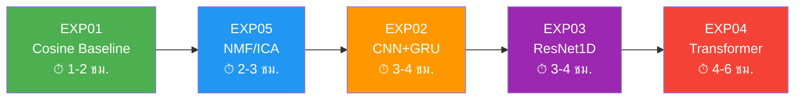

# 🧪 แผนการทดลอง — NMR Peak Annotation

> **เป้าหมาย:** รับ Binning Table เข้า → ระบุชื่อสารเคมี (Metabolite) ที่มีอยู่ในตัวอย่างออกมาได้ 100% อัตโนมัติ
> **ข้อมูลตั้งต้น:** [realistic_nmr_data_large.csv](file:///d:/hack/BDI/Test_for_finalist/data/realistic_nmr_data_large.csv) (10,001 ppm × 1,000 samples, 38 metabolites, มีเฉลยใน [realistic_nmr_ground_truth.csv](file:///d:/hack/BDI/Test_for_finalist/data/realistic_nmr_ground_truth.csv))

---

## 📁 โครงสร้างโฟลเดอร์ที่เสนอ

```
Test_for_finalist/
├── data/                              # ← ข้อมูลตั้งต้นทั้งหมด
│   ├── realistic_nmr_data_large.csv   # ✅ มีแล้ว (10,001 × 1,000, 38 สาร)
│   ├── realistic_nmr_ground_truth.csv # ✅ มีแล้ว (เฉลยความเข้มข้น 38 สาร × 1,000 samples)
│   ├── generate_realistic_nmr_data.py # ✅ สคริปต์สร้างข้อมูล (รองรับ --samples N)
│   └── reference_library/             # ✅ มีแล้ว
│       └── reference_library_38.csv   #    ลายเซ็นสาร 38 ชนิด (จาก NMRQNet)
├── EXP01_cosine_baseline/             # ← ทดลองที่ 1 (ถัดไป)
├── EXP02_cnn_nmrqnet/                 # ← ทดลองที่ 2
├── EXP03_resnet1d/                    # ← ทดลองที่ 3
├── EXP04_transformer/                 # ← ทดลองที่ 4
├── EXP05_nmf_decomposition/           # ← ทดลองที่ 5
└── results_comparison.md              # ← สรุปผลเปรียบเทียบทุกการทดลอง
```

---

## 🔬 รายละเอียดแต่ละการทดลอง

---

### EXP01: Cosine Similarity Baseline (ไม่ใช้ AI / Rule-Based)

> **แนวคิด:** เอาสเปกตรัมของตัวอย่าง ไปเทียบกับ "ลายเซ็น" ของสารแต่ละตัวในฐานข้อมูลอ้างอิง แล้วดูว่ามุมระหว่างเวกเตอร์ทั้งสองใกล้เคียงกันแค่ไหน

| รายการ | รายละเอียด |
| :--- | :--- |
| **ประเภท** | Classical / Non-AI Baseline |
| **หลักการ** | Cosine Similarity ระหว่างสเปกตรัมตัวอย่างกับ Reference Spectra ของสารแต่ละชนิด |
| **ทำไมต้องทดลองนี้** | เป็น Baseline ที่ง่ายที่สุด ถ้ามันทำงานได้ดีอยู่แล้ว แปลว่าโจทย์ไม่ซับซ้อนพอที่ต้องใช้ AI / ถ้ามันแย่ จะเป็นตัวเทียบว่า AI ดีขึ้นจริงแค่ไหน |
| **Input** | สเปกตรัมตัวอย่าง 1 เส้น (10,001 จุด) + ไลบรารีลายเซ็นสาร |
| **Output** | รายชื่อสารที่มี Similarity Score สูงเกินค่า Threshold |
| **ข้อจำกัดที่คาดว่าจะเจอ** | จะล้มเหลวเมื่อพีคทับซ้อนกัน (Overlapping Peaks) เพราะวิธีนี้เปรียบเทียบ "ทั้งเส้นกราฟ" ไม่ได้แยกพีคเป็นส่วนๆ |

---

### EXP02: CNN + GRU (สไตล์ NMRQNet)

> **แนวคิด:** ใช้สถาปัตยกรรมของ NMRQNet ที่มีอยู่แล้ว (Conv1D + GRU) เทรนใหม่กับข้อมูลของเราเพื่อจำแนกสาร

| รายการ | รายละเอียด |
| :--- | :--- |
| **ประเภท** | Deep Learning (Supervised) |
| **หลักการ** | Conv1D หลายชั้นเพื่อจับ Local Pattern ของพีค → GRU เพื่อจับ Sequential Context ของลำดับพีค → Dense Layer สำหรับ Multi-Label Classification |
| **โมเดลอ้างอิง** | [model_9ident.py](file:///d:/hack/BDI/NMRQNet/codes/training/model_9ident.py) (Identification) + [model_9quant.py](file:///d:/hack/BDI/NMRQNet/codes/training/model_9quant.py) (Quantification) |
| **ทำไมต้องทดลองนี้** | เรามีโค้ดพร้อมใช้แล้ว + มี Pre-trained Model (.h5) อยู่ สามารถ Fine-tune ได้ทันที |
| **Input** | สเปกตรัม 1D (10,001 จุด) reshape เป็น (10001, 1) |
| **Output** | Sigmoid probability สำหรับแต่ละสาร (Multi-Label) |
| **สิ่งที่ต้องทำเพิ่ม** | ต้องสร้าง Ground Truth Label ให้ข้อมูลของเรา (ถ้าใช้ข้อมูลจำลอง เราทราบอยู่แล้วว่าผสมสารอะไรบ้าง) |

---

### EXP03: 1D-ResNet (Residual Network)

> **แนวคิด:** ใช้โครงข่าย Residual 1D ที่ลึกกว่า CNN ธรรมดา เพื่อจับ Feature ที่ซับซ้อนของพีคทับซ้อนได้ดีขึ้น

| รายการ | รายละเอียด |
| :--- | :--- |
| **ประเภท** | Deep Learning (Supervised) |
| **หลักการ** | Residual Connections ช่วยให้เทรนโครงข่ายลึกได้โดยไม่เกิด Vanishing Gradient → จับ Multi-Scale Features ของพีค (ทั้งพีคแคบแหลมและพีคกว้างนุ่ม) |
| **โมเดลอ้างอิง** | [resnet1d.py](file:///d:/hack/BDI/resnet1d/resnet1d.py) (มีอยู่ในโปรเจกต์แล้ว) |
| **ทำไมต้องทดลองนี้** | ResNet เป็นหนึ่งในสถาปัตยกรรมที่ดีที่สุดสำหรับ 1D signal classification ทั้งในงาน ECG และ NMR |
| **Input** | สเปกตรัม 1D (10,001 จุด) |
| **Output** | Multi-Label Classification / Regression (ความเข้มข้นสาร) |
| **จุดเด่นเทียบ EXP02** | ลึกกว่า (มี Skip Connections) + ไม่ต้องใช้ GRU ที่ช้าในการเทรน |

---

### EXP04: Transformer-based (Self-Attention)

> **แนวคิด:** ใช้กลไก Self-Attention เพื่อให้โมเดลสามารถ "มองข้าม" ไปเชื่อมโยงพีคที่อยู่ห่างกันบนแกน ppm ได้ (เหมาะกับสารที่มีพีคหลายตำแหน่งกระจายอยู่)

| รายการ | รายละเอียด |
| :--- | :--- |
| **ประเภท** | Deep Learning (Supervised) |
| **หลักการ** | ตัดสเปกตรัม 10,001 จุดเป็น Patches → Positional Encoding เพื่อบอกตำแหน่ง ppm → Self-Attention เพื่อจับความสัมพันธ์ของพีคที่อยู่คนละฝั่งของกราฟ |
| **ทำไมต้องทดลองนี้** | สารเคมี 1 ตัว (เช่น Lactate) มีพีคอยู่หลายตำแหน่ง (1.33 ppm และ 4.1 ppm) ซึ่ง CNN มองเห็นแค่ Local จะไม่เข้าใจว่าพีค 2 จุดนี้เป็นของสารเดียวกัน แต่ Transformer เข้าใจได้ |
| **Input** | สเปกตรัม 1D ตัดเป็น Patches (เช่น 100 patches × 100 จุด) |
| **Output** | Multi-Label Classification |
| **ข้อควรระวัง** | ต้องใช้ RAM/GPU มากกว่า CNN เพราะ Attention Matrix ใหญ่ ต้องออกแบบ Patch Size ให้เหมาะสม |

---

### EXP05: NMF / ICA Decomposition (ไม่ต้องเทรน)

> **แนวคิด:** ใช้วิธีทางคณิตศาสตร์ในการ "แยกส่วนผสม" (Blind Source Separation) โดยไม่ต้องมี Label สำหรับเทรนเลย

| รายการ | รายละเอียด |
| :--- | :--- |
| **ประเภท** | Unsupervised / Mathematical Decomposition |
| **หลักการ** | **NMF (Non-negative Matrix Factorization):** แยกตาราง Intensity ออกเป็น 2 ส่วน คือ "ลายเซ็นสาร" กับ "ความเข้มข้น" / **ICA (Independent Component Analysis):** แยกสัญญาณที่เป็นอิสระต่อกันออกจากสัญญาณรวม |
| **ทำไมต้องทดลองนี้** | เป็นแนวทางที่ต่างจาก Supervised Learning อย่างสิ้นเชิง → ไม่ต้องมี Ground Truth Label → เหมาะกับสถานการณ์จริงที่เราไม่รู้คำตอบ |
| **Input** | ตาราง Binning ทั้งหมด (10,001 × 1,000) |
| **Output** | Component Spectra (ลายเซ็นสารที่แยกออกมา) + Mixing Matrix (สัดส่วนของสารในแต่ละตัวอย่าง) |
| **ข้อจำกัด** | ต้องกำหนดจำนวนสาร (K) ล่วงหน้า + ลายเซ็นที่แยกออกมาอาจไม่ตรงกับสารจริง 100% |

---

## 📊 ตารางเปรียบเทียบ

| เกณฑ์ | EXP01 Cosine | EXP02 CNN+GRU | EXP03 ResNet1D | EXP04 Transformer | EXP05 NMF/ICA |
| :--- | :---: | :---: | :---: | :---: | :---: |
| **ต้องเทรน** | ❌ | ✅ | ✅ | ✅ | ❌ |
| **ต้องมี Label** | ❌ (ใช้ Ref Lib) | ✅ | ✅ | ✅ | ❌ |
| **แยกพีคทับซ้อน** | ❌ | ⚠️ พอได้ | ✅ ดี | ✅ ดีมาก | ✅ ดี |
| **จับพีคข้ามตำแหน่ง** | ❌ | ⚠️ ได้บ้าง (GRU) | ⚠️ ได้บ้าง | ✅ ดีมาก | ❌ |
| **ความเร็วในการ Infer** | ⚡ เร็วมาก | 🔵 ปานกลาง | 🔵 ปานกลาง | 🟡 ช้า | ⚡ เร็ว |
| **ใช้ GPU** | ❌ | ✅ | ✅ | ✅ | ❌ |
| **ความง่ายในการเริ่ม** | ⭐⭐⭐⭐⭐ | ⭐⭐⭐⭐ (มีโค้ดแล้ว) | ⭐⭐⭐⭐ (มีโค้ดแล้ว) | ⭐⭐⭐ (ต้องเขียนใหม่) | ⭐⭐⭐⭐ (ใช้ sklearn) |

---

## 🚦 ลำดับการทดลองที่แนะนำ



**เหตุผลของลำดับ:**
1. **EXP01 ก่อน** → ใช้เป็น Benchmark ตั้งต้น + ไม่ต้องเทรน + เข้าใจข้อมูลก่อน
2. **EXP05 ที่สอง** → ไม่ต้องเทรนเหมือนกัน แต่เป็น Unsupervised → ดูว่าแยกสารได้ไหมโดยไม่ต้องบอกคำตอบ
3. **EXP02-03-04** → เรียงจากง่ายไปยาก ใช้โค้ดที่มีอยู่ก่อน แล้วค่อยเขียนใหม่

---

## ✅ สถานะการเตรียมข้อมูล

> [!NOTE]
> **1. Reference Library (ลายเซ็นสาร): ✅ เสร็จแล้ว**
> ไฟล์ `reference_library_38.csv` ถูกคัดลอกมาไว้ที่ `data/reference_library/` เรียบร้อยแล้ว มีลายเซ็นของสาร **38 ชนิด** ซึ่งถูกสร้างจากข้อมูลลายเซ็นจริงของ NMRQNet (Lorentzian peak signatures)
>
> **วันแข่งจริง:** เปลี่ยนไฟล์นี้เป็นฐานข้อมูล HMDB (หลายร้อยสาร) โดยไม่ต้องแก้โค้ดโมเดล

> [!NOTE]
> **2. Ground Truth Label: ✅ เสร็จแล้ว**
> ไฟล์ `realistic_nmr_ground_truth.csv` ถูกสร้างพร้อมกับข้อมูลแล้ว — มี 1,000 แถว (1 แถว = 1 Sample) × 39 คอลัมน์ (Sample_ID + ความเข้มข้นสาร 38 ชนิด) พร้อมใช้สำหรับเทรน EXP02-04 และวัดผล EXP01/EXP05 ได้ทันที

> [!NOTE]
> **3. ข้อมูล Mock: ✅ อัปเกรดแล้ว**
> `realistic_nmr_data_large.csv` ถูกสร้างใหม่ด้วยสาร **38 ชนิด** แต่ละ Sample ผสมสาร 10-38 ชนิดแบบสุ่ม ทำให้เกิด Overlapping Peaks ที่สมจริงและซับซ้อน
>
> **ต้องการข้อมูลมากขึ้น?** รันคำสั่ง: `python generate_realistic_nmr_data.py --samples 10000`

## Open Questions

> [!IMPORTANT]
> **Q1:** คุณมี GPU ในเครื่องหรือไม่? ถ้ามี สามารถเทรน Deep Learning (EXP02-04) ได้เต็มที่ ถ้าไม่มีอาจต้องใช้ Google Colab
